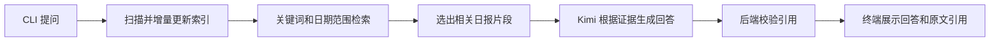

# Digital Twin CLI MVP Spec

## 1. 项目概述

### 1.1 产品定义

`Digital Twin` 是一个本地运行的 Python CLI Agent。它只读访问指定目录中的个人工作日报，检索与用户问题相关的内容，并调用 Kimi 生成有依据的回答。

日报是系统的唯一事实来源。每个事实性回答都必须展示对应的本地文件引用和原文片段。日报中没有足够信息时，Agent 必须明确说明无法回答，不得根据常识猜测或补全。

### 1.2 MVP 目标

第一版用于验证以下问题：

1. Agent 能否稳定读取本地日报并建立可用索引。
2. Agent 能否准确回答关于个人工作内容、项目进度和问题处理记录的问题。
3. 回答是否能够追溯到具体日报文件和原文片段。
4. 日报缺少相关信息时，Agent 是否能够可靠地拒绝回答。

### 1.3 MVP 不包含的功能

- Web 页面
- 公网访问
- Docker 部署
- 管理后台
- 日报上传
- 社交媒体机器人
- 访客账户体系
- 自动执行任务
- 语音、视频或数字人形象
- 模仿用户的表达风格、性格或价值观
- 向量数据库

## 2. 使用场景

用户可以在本地终端中询问：

```text
最近一周做了什么？
参与过哪些项目？
上周遇到了哪些问题？
数字分身项目目前进展如何？
最近输出了哪些成果？
```

Agent 返回：

1. 基于日报生成的回答。
2. 引用的日报文件路径。
3. 支持回答的原文片段。

## 3. CLI 设计

### 3.1 启动方式

```bash
uv run digital-twin chat
```

### 3.2 命令

| 命令 | 用途 |
| --- | --- |
| `uv run digital-twin chat` | 启动交互式多轮问答 |
| `uv run digital-twin ask "问题"` | 执行单次问答 |
| `uv run digital-twin index` | 扫描日报目录并刷新索引 |
| `uv run digital-twin status` | 查看索引文件数量和最后更新时间 |

交互式聊天中的内置命令：

| 命令 | 用途 |
| --- | --- |
| `/reload` | 刷新日报索引 |
| `/exit` | 退出聊天 |

### 3.3 交互示例

```text
Digital Twin CLI
输入 /exit 退出，输入 /reload 重新加载日报。

> 最近一周做了什么？

根据日报，最近一周主要推进了数字分身项目。

引用：
[1] knowledge/reports/2026-05-31.md
    完成 FastAPI 项目结构设计。
```

## 4. 本地文件设计

### 4.1 默认目录

```text
knowledge/
  reports/
    2026-05-29.md
    2026-05-30.md
    2026-05-31.md
data/
  index.db
```

### 4.2 支持格式

- `.md`
- `.txt`

第一版不强制正文格式。建议文件名以 `YYYY-MM-DD` 日期开头，以便进行日期范围检索。

推荐示例：

```markdown
# 项目名称

数字分身项目

## 当日工作内容

- 完成 CLI MVP 规格设计。
- 确认使用 Kimi 作为第一版模型。

## 问题与障碍

- 尚未确定日报的最终解析规则。

## 次日计划

- 搭建 Python 项目骨架。
```

### 4.3 文件访问约束

- Agent 仅允许读取配置的日报目录。
- Agent 不得修改、新增或删除日报文件。
- Agent 必须忽略目录外的文件。
- Agent 必须忽略非 `.md` 和 `.txt` 文件。
- Agent 必须忽略超过大小限制的文件，并在索引结果中提示。
- Agent 必须阻止通过路径构造读取日报目录外文件。

## 5. 系统流程



### 5.1 索引流程

1. 扫描日报目录。
2. 仅读取白名单格式文件。
3. 计算文件哈希。
4. 新增文件时建立索引。
5. 文件内容变化时更新索引。
6. 文件删除时清理对应索引。
7. 将索引保存到 SQLite 数据库。

### 5.2 分片规则

第一版使用简单、可替换的分片策略：

1. Markdown 优先按照标题和段落拆分。
2. TXT 按照空行拆分段落。
3. 过长段落按字符长度继续切分。
4. 每个片段保存来源文件、日期、标题和原文。

后续确定日报模板后，可以替换为结构化解析器，不改变问答接口。

### 5.3 检索流程

1. 从问题中识别可选的日期范围，例如“上周”和“最近一个月”。
2. 使用 SQLite `FTS5` 执行全文检索。
3. 在适用时使用日期范围过滤结果。
4. 按相关度返回最多 `TOP_K` 个片段。
5. 没有相关片段时直接返回“日报中没有找到足够的信息”，不调用 Kimi。

### 5.4 生成与引用校验

1. 将问题和检索到的片段传给 Kimi。
2. 每个片段使用稳定的引用编号。
3. 要求 Kimi 返回结构化 JSON。
4. 校验引用编号是否属于本次提供的片段。
5. 引用不存在或格式非法时，拒绝展示生成答案。
6. 每项事实性结论必须至少对应一个有效引用。

建议的模型输出格式：

```json
{
  "status": "grounded",
  "answer": "最近主要推进了数字分身项目。",
  "citations": ["chunk-1"]
}
```

支持的状态：

| 状态 | 含义 |
| --- | --- |
| `grounded` | 日报中存在直接证据 |
| `partial` | 只能根据日报回答问题的一部分 |
| `not_found` | 日报中没有足够依据 |

## 6. Prompt 约束

系统提示词至少包含以下规则：

```text
你是一个个人工作日报问答助手。
只能依据提供的日报片段回答问题。
不得使用常识补全事实，不得猜测，不得编造。
每项事实性结论必须引用至少一个片段编号。
资料不足时，返回 not_found 并明确说明日报中没有相关记录。
```

## 7. 技术方案

### 7.1 技术栈

| 领域 | 选择 |
| --- | --- |
| 语言 | Python 3.12 |
| CLI | Typer |
| 数据库 | SQLite |
| 全文检索 | SQLite `FTS5` |
| 模型调用 | LiteLLM Python SDK |
| MVP 模型 | Kimi |
| 配置 | 环境变量和 `.env` |
| 测试 | pytest |
| 包管理和运行 | uv |

### 7.2 模型配置

LiteLLM 模型名称通过环境变量配置，避免将具体模型硬编码到业务代码中。

```env
KNOWLEDGE_DIR=knowledge/reports
DATABASE_PATH=data/index.db
LITELLM_MODEL=moonshot/kimi-k2.5
MOONSHOT_API_KEY=
TOP_K=8
MAX_FILE_SIZE_KB=512
```

API Key 只能从环境变量读取，不得保存到数据库或提交到 Git。

### 7.3 推荐目录结构

```text
pyproject.toml
.env.example
.gitignore
README.md
SPEC.md
src/
  digital_twin/
    __init__.py
    cli.py
    config.py
    indexer.py
    retrieval.py
    llm.py
    schemas.py
tests/
  test_indexer.py
  test_retrieval.py
  test_answer_validation.py
knowledge/
  reports/
data/
```

## 8. 数据结构

SQLite 数据库建议包含以下表。

### 8.1 `report_files`

| 字段 | 类型 | 说明 |
| --- | --- | --- |
| `id` | Integer | 主键 |
| `relative_path` | Text | 日报目录内的相对路径 |
| `content_hash` | Text | 文件内容哈希 |
| `report_date` | Date, Nullable | 从文件名或正文提取的日期 |
| `modified_at` | DateTime | 文件修改时间 |
| `indexed_at` | DateTime | 最后索引时间 |

### 8.2 `report_chunks`

| 字段 | 类型 | 说明 |
| --- | --- | --- |
| `id` | Integer | 主键 |
| `file_id` | Integer | 来源文件 ID |
| `heading` | Text, Nullable | Markdown 标题 |
| `content` | Text | 原文片段 |
| `chunk_order` | Integer | 片段在文件中的顺序 |

### 8.3 `report_chunks_fts`

使用 SQLite `FTS5` 建立全文索引，至少索引：

- `heading`
- `content`

第一版不保存聊天记录。

## 9. Agent 能力边界

Agent 可以：

- 只读扫描日报目录。
- 建立和刷新本地索引。
- 检索相关片段。
- 调用 Kimi 生成回答。
- 在终端展示引用。

Agent 不可以：

- 修改日报。
- 读取日报目录外的业务文件。
- 执行 Shell 命令。
- 自动访问互联网内容。
- 调用社交媒体、邮件或其他外部工具。
- 根据日报之外的信息回答事实问题。

## 10. 错误处理

| 场景 | 处理方式 |
| --- | --- |
| 日报目录不存在 | 给出明确提示并退出 |
| 数据库目录不存在 | 自动创建 |
| 文件编码异常 | 跳过文件并显示警告 |
| 文件超过大小限制 | 跳过文件并显示警告 |
| FTS 没有匹配结果 | 不调用模型，返回 `not_found` |
| Kimi API Key 缺失 | 在调用模型前提示如何配置 |
| Kimi API 调用失败 | 显示简洁错误，不输出敏感信息 |
| Kimi 返回非法 JSON | 拒绝输出生成答案 |
| Kimi 返回无效引用 | 拒绝输出生成答案 |

## 11. 验收标准

### 11.1 索引

- 新增日报后，执行 `index` 可以检索到新内容。
- 修改日报后，执行 `index` 可以刷新对应索引。
- 删除日报后，执行 `index` 可以清除对应索引。
- `.md` 和 `.txt` 以外的文件不会进入索引。
- 超过大小限制的文件不会进入索引，并产生提示。
- Agent 无法通过构造路径读取日报目录外文件。

### 11.2 检索

- 关键词问题可以召回相关日报片段。
- 包含日期范围的问题可以优先检索对应时间段。
- 无匹配内容时不会调用 Kimi。

### 11.3 回答

- `ask` 命令可以输出回答、文件路径和原文引用。
- `chat` 命令可以连续接受问题。
- 每个事实回答至少包含一条有效引用。
- Kimi 返回无效引用时，不展示未经验证的答案。
- API Key 不进入数据库、不进入日志、不提交到 Git。

### 11.4 测试

至少覆盖：

- 文件扫描白名单
- 文件新增、修改和删除
- Markdown 与 TXT 分片
- 日期提取
- FTS 检索
- 无结果时跳过模型调用
- 引用校验

## 12. 开发阶段

| 阶段 | 内容 |
| --- | --- |
| Phase 1 | CLI 骨架、配置、文件扫描、SQLite 索引 |
| Phase 2 | 分片、FTS5 检索、日期识别 |
| Phase 3 | LiteLLM 接入 Kimi、结构化回答、引用校验 |
| Phase 4 | 自动化测试、README、示例日报 |

## 13. 后续扩展

以下能力不属于 MVP，但当前设计应保留扩展空间：

1. 根据固定日报模板增加结构化解析。
2. 增加向量检索和关键词混合检索。
3. 使用 Docker 打包本地运行环境。
4. 增加 Web 页面。
5. 增加限流和公网部署能力。
6. 从本地设备以只读方式暴露服务。

