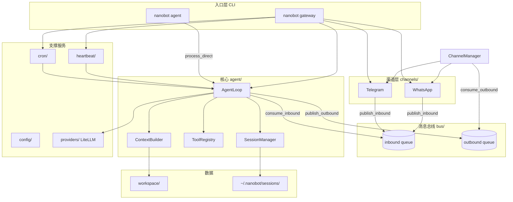

这是 **nanobot**（README 里写的轻量个人 AI 助手，灵感来自 Clawdbot）。整体是「消息总线 + Agent 循环 + 多渠道 + 定时/心跳」的分层架构，代码量刻意控制在约 4000 行，方便阅读和改。

---

## 总体定位

nanobot 做三件事：

1. **对话**：通过 CLI 或 Telegram/WhatsApp 与用户聊天
2. **执行**：用工具读写文件、跑 shell、搜网页等
3. **持久化**：workspace 里的记忆、会话历史、Skills 说明

---

## 架构总览



核心思想：**渠道和 Agent 通过 `MessageBus` 解耦**，渠道只负责收发，Agent 只负责「想 + 调工具」。

---

## 两种运行模式

| 模式         | 命令                     | 特点                                        |
| ------------ | ------------------------ | ------------------------------------------- |
| **单机对话** | `nanobot agent -m "..."` | 不启渠道，直接 `AgentLoop.process_direct()` |
| **网关服务** | `nanobot gateway`        | 同时跑 Agent 循环、渠道、Cron、Heartbeat    |

Gateway 在 `cli/commands.py` 里组装所有组件：

```252:259:nanobot/cli/commands.py
    async def run():
        try:
            await cron.start()
            await heartbeat.start()
            await asyncio.gather(
                agent.run(),
                channels.start_all(),
            )
```

---

## 1. 消息总线（`bus/`）

- **`InboundMessage`**：渠道 → Agent（channel、sender_id、chat_id、content）
- **`OutboundMessage`**：Agent → 渠道
- **`MessageBus`**：两个 `asyncio.Queue`，实现生产者/消费者

```25:35:nanobot/bus/queue.py
    async def publish_inbound(self, msg: InboundMessage) -> None:
        """Publish a message from a channel to the agent."""
        await self.inbound.put(msg)

    async def publish_outbound(self, msg: OutboundMessage) -> None:
        """Publish a response from the agent to channels."""
        await self.outbound.put(msg)
```

会话键：`channel:chat_id`（例如 `telegram:123456`），用于区分不同聊天。

---

## 2. Agent 核心（`agent/`）—— 心脏

### AgentLoop

主循环在 `agent/loop.py`：

1. 从 bus 取入站消息（或 CLI 直接构造）
2. 用 `ContextBuilder` 拼 system prompt + 历史 + 当前用户消息
3. 调 LLM（带 tool definitions）
4. 若有 tool_calls → 执行 → 把结果塞回 messages → 再调 LLM（最多 `max_iterations` 次，默认 20）
5. 把最终回复写入 session，并 `publish_outbound`

默认注册的工具：读/写/编辑文件、列目录、shell、网页搜索/抓取、`message`（向指定渠道发消息）。

### ContextBuilder

负责 **system prompt 拼装**：

- 固定身份说明（时间、workspace 路径）
- workspace 引导文件：`AGENTS.md`、`SOUL.md`、`USER.md`、`TOOLS.md` 等
- **Memory**：`memory/MEMORY.md` + 当日 `memory/YYYY-MM-DD.md`
- **Skills**：渐进式加载——`always` 技能全文进 prompt；其余只给 XML 摘要，需要时用 `read_file` 读 `SKILL.md`

### SessionManager

会话存在 `~/.nanobot/sessions/`，JSONL 格式，按 `channel:chat_id` 分文件，保留最近约 50 条给 LLM 当 history。

### MemoryStore

文件型记忆，和 Clawdbot 风格兼容；Agent 被提示可通过写 `MEMORY.md` 做长期记忆。

### SkillsLoader

内置技能在 `nanobot/skills/`（weather、tmux、github 等），用户可在 `workspace/skills/` 覆盖；frontmatter 里可声明依赖（CLI、环境变量）和 `always` 标记。

---

## 3. 渠道层（`channels/`）

- **`BaseChannel`**：抽象 `start` / `stop` / `send`；`_handle_message` 做 allowlist 后 `publish_inbound`
- **`ChannelManager`**：按配置实例化 Telegram/WhatsApp，并后台消费 outbound 队列，路由到对应 channel 的 `send`
- **Telegram**：python-telegram-bot，长轮询，无需公网 webhook
- **WhatsApp**：通过 Node bridge（WebSocket `ws://localhost:3001`），需 `nanobot channels login` 扫码

安全：`allow_from` 白名单，空列表表示允许所有人。

---

## 4. LLM 提供方（`providers/`）

- 抽象接口：`LLMProvider.chat()` → `LLMResponse`（content + tool_calls）
- 实现：**LiteLLM**，统一对接 OpenRouter / Anthropic / OpenAI 等
- 配置优先级：OpenRouter API key > Anthropic > OpenAI（`config/schema.py`）

---

## 5. 配置（`config/`）

- 默认路径：`~/.nanobot/config.json`（Pydantic `Config`）
- 字段：`agents`（model、workspace、max_tool_iterations）、`channels`、`providers`、`tools.web.search`（Brave API key）等
- `nanobot onboard` 会创建 config + workspace 模板（AGENTS/SOUL/USER、memory/MEMORY.md）

---

## 6. 定时与心跳

| 组件                 | 作用                                                                                                         |
| -------------------- | ------------------------------------------------------------------------------------------------------------ |
| **CronService**      | 定时任务（every / cron 表达式 / 一次性 at），触发时调用 `agent.process_direct()`，可选把结果发到 WhatsApp 等 |
| **HeartbeatService** | 默认每 30 分钟读 `workspace/HEARTBEAT.md`，有任务则唤醒 Agent；无事则回复 `HEARTBEAT_OK`                     |

两者都复用同一个 `AgentLoop`，只是 `session_key` 不同（如 `cron:{job_id}`、`heartbeat`）。

---

## 7. Workspace 数据模型

```
~/.nanobot/
├── config.json          # 全局配置
├── sessions/*.jsonl     # 对话历史
└── workspace/           # Agent 的“家”
    ├── AGENTS.md        # 行为指令
    ├── SOUL.md          # 人格
    ├── USER.md          # 用户信息
    ├── HEARTBEAT.md     # 周期性待办
    ├── memory/
    │   ├── MEMORY.md    # 长期记忆
    │   └── YYYY-MM-DD.md
    └── skills/          # 用户自定义技能
```

Agent 通过 **文件 + 工具** 与这个世界交互，而不是内置数据库。

---

## 一条消息的完整路径（Gateway + Telegram）

1. 用户在 Telegram 发消息
2. `TelegramChannel` → `bus.publish_inbound(InboundMessage)`
3. `AgentLoop.run()` 消费 → `_process_message`
4. `SessionManager.get_or_create("telegram:chat_id")`
5. `ContextBuilder.build_messages(history, content)`
6. `LiteLLMProvider.chat(messages, tools)`
7. 若有工具调用 → `ToolRegistry.execute` → 循环直到无 tool_calls
8. 保存 session → `bus.publish_outbound(OutboundMessage)`
9. `ChannelManager._dispatch_outbound` → `TelegramChannel.send`

---

## 设计特点（为什么好读）

1. **总线解耦**：加 Discord/Slack 只需新 Channel + 注册到 Manager
2. **单一 Agent 循环**：CLI、Cron、Heartbeat 都走同一套 `_process_message`
3. **渐进式 Skills**：prompt 不塞满所有技能，按需 `read_file`
4. **文件即状态**：记忆、人格、待办都在 workspace，便于人工编辑和版本管理

---

## 目录与职责对照

```
nanobot/
├── agent/          # 循环、上下文、记忆、技能、tools/
├── bus/            # 入站/出站事件与队列
├── channels/       # Telegram、WhatsApp、ChannelManager
├── cli/            # Typer 命令：onboard、agent、gateway、cron、channels
├── config/         # Pydantic 配置加载
├── providers/      # LiteLLM 封装
├── session/        # JSONL 会话持久化
├── cron/           # 定时任务
├── heartbeat/      # 周期性唤醒
├── skills/         # 内置 SKILL.md
└── utils/          # 路径、日期等辅助函数
```

---

如果你想深入某一块（例如 tool 怎么注册、WhatsApp bridge 协议、或和 Cursor Agent 的对比），可以说一下关注点，我可以按模块再拆一版。当前是 Ask 模式，我只能讲解；若要改代码或画更细的时序图，需要切换到 Agent 模式。
